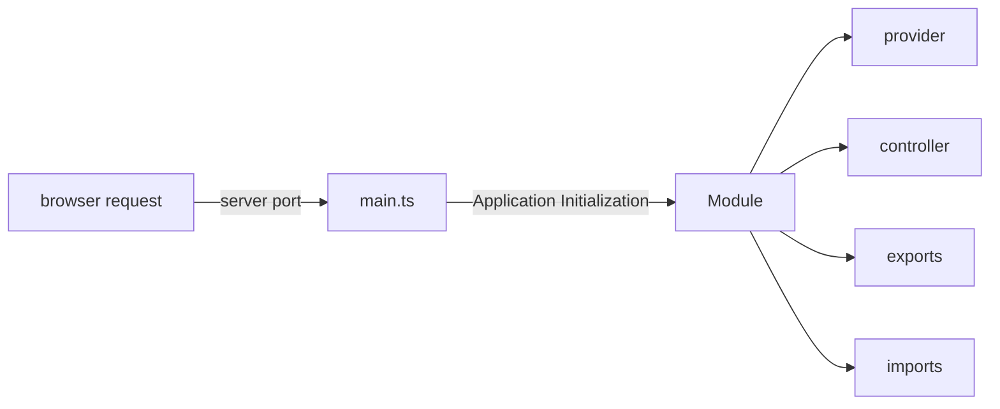

# learn-nestjs

- NestJS tutorial using Typescript, Yarn as package manager
- Node 20, Nest 10

### Installations

- Latest Node, NPM, Yarn
- **NestJS CLI**: `yarn global add @nestjs/cli`
- **Generate UUID**: `yarn add uuid`

### Get Familiar with Terms

| Term                   | Interpretation                                                                                        | Usage                                    |
| ---------------------- | ----------------------------------------------------------------------------------------------------- | ---------------------------------------- |
| Modules                | File that serves as entry point. Resembles with a set of capabilities of a Feature in the application | Annotate with decorator - @Module        |
| Controllers            | Instantiated within module. Control incoming requests and return response to client                   | Annotate - @Controller , @Get, @Post ... |
| Services               | Type of providers, but are of type singleton. Called from Controllers                                 | @Injectable                              |
| Providers              | Dependencies injected into Modules. Used in Modules                                                   | @Injectable                              |
| Exports                | Providers to export to other modules                                                                  |                                          |
| Pipes                  |                                                                                                       |                                          |
| AuthN, AuthZ using JWT |                                                                                                       |                                          |
| TypeORM                |                                                                                                       |                                          |
| QueryBuilder (ORM)     |                                                                                                       |                                          |
| Password Hashing       |                                                                                                       |                                          |
| Deployment of UI (S3)  |                                                                                                       |                                          |
| Deployment of Backend  |                                                                                                       |                                          |

### Getting Started

- Generate a project from CLI: `nest new <app_name>`
- The file named `app.module.ts` is the root file to begin, this is referred in `main.ts`. Leaving behind these two files in source folder, every other starter file can be removed.
- Run the application `yarn start:dev`. This runs the application in watch mode, so it restarts automatically with every change
- To create a new nest component such as module, service or controller, a best practice is to use nest cli to generate it using command `nest g <component_type> <component_name>`
- Generate Controller using CLI : `nest g controller <name> --no-spec` [do not create default test file, remember to send the same name for auto update]
- Generate Service using CLI : `nest g service <name> --no-spec` [remember to send the same name for auto update]

### Project Structure

1. **main.ts** : This is the entry point of every Nest.js based server. It has the code to listen to http traffic on a specified port and initializes **AppModule**
   Example:

```ts
async function bootstrap() {
  const app = await NestFactory.create(AppModule);
  await app.listen(3000);
}
bootstrap();
```

2. **Module** : Each Nest application must have at least one module. Module is the entry point to unit of functionality. This is the first object initialized from **main.ts**.

- Good Practice: Have one module per folder to keep functionalities better organized
- Important: Modules are singletons. So one instance can be imported by other modules
- Generate Module using CLI : `nest g module <name>`

Example:

```ts
@Module({
  providers: [RootService],
  controllers: [RootController],
  imports: [childModule, anotherChildModule, yetAnotherChildModule],
  exports: [RootService],
})
export class RootModule {}
```



3. **Controller** - Every module has a controller, that listens to http traffic and sends response.

- Every controller must be bound to a url path
- Contain handlers to handle endpoints such as GET, POST etc.
- Use service using dependency injection

4. **Service** - Class that has the business logic that is usually invoked from Controller.

- Service must be annotated with `@Injectable` annotation to be imported into handler methods inside controllers initiated as **Singleton** pattern.

5. **Data Transfer Object (DTO)** - Object to transfer data through network

- Responsible for storage, retrieval, serialization of data
- DTOs recommended to be created as Classes instead of interfaces
- It is different than creating models for entities
- DTOs are not mandatory, but useful for data consistency

### References:

-
