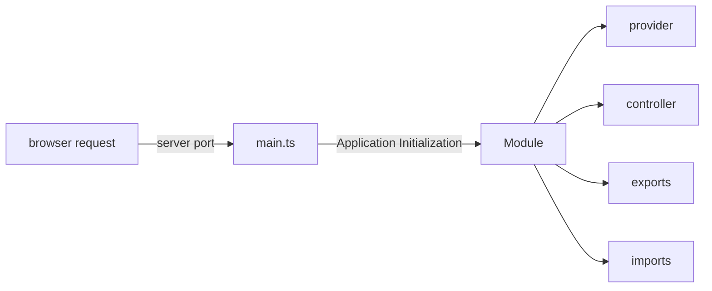

# learn-nestjs

- NestJS tutorial using Typescript, Yarn as package manager
- Node 20, Nest 10

### Installations

- Latest Node, NPM, Yarn
- **NestJS CLI**: `yarn global add @nestjs/cli` or `npm -g install @nestjs/cli`
- **Generate UUID**: `yarn add uuid`

### Getting Started

- Generate a project from CLI: `nest new <app_name>`
- The file named `app.module.ts` is the root file to begin, this is referred in `main.ts`. Leaving behind these two files in source folder, every other starter file can be removed.
- Run the application `yarn start:dev`. This runs the application in watch mode, so it restarts automatically with every change
- To create a new nest component such as module, service or controller, a best practice is to use nest cli to generate it using command `nest g <component_type> <component_name>`
- Generate Module using CLI : `nest g module <name> --no-spec` [do not create default test file, remember to send the same name for auto update]
- Generate Controller using CLI : `nest g controller <name> --no-spec` [do not create default test file, remember to send the same name for auto update]
- Generate Service using CLI : `nest g service <name> --no-spec` [remember to send the same name for auto update]
- For DB Postgres SQL is used that runs on Docker. To start using Postgres on Docker run:
   ```sh
    docker run --name postgres-nest -p 5432:5432 -e POSTGRES_PASSWORD=<redacted> -d postgres
   ```
  - Check container status : `docker container ls`
  - Stop container: `docker container stop postgres-nest`
  - Remove postgres: `docker container rm postgres-nest`
- Create server and database in PGAdmin tool. The database name in this project is : `nest-task-tutorial`

### Project Structure

1. **main.ts** : This is the entry point of every Nest.js based server. It has the code to listen to http traffic on a specified port and initializes **AppModule**
   Example:

```ts
async function bootstrap() {
  const app = await NestFactory.create(AppModule);
  await app.listen(3000);
}
bootstrap();
```

2. **Module** : Each Nest application must have at least one module. Module is the entry point to unit of functionality. This is the first object initialized from **main.ts**.

- Good Practice: Have one module per folder to keep functionalities better organized
- Important: Modules are singletons. So one instance can be imported by other modules
- Generate Module using CLI : `nest g module <name>`

Example:

```ts
@Module({
  providers: [RootService],
  controllers: [RootController],
  imports: [childModule, anotherChildModule, yetAnotherChildModule],
  exports: [RootService],
})
export class RootModule {}
```



3. **Controller** - Every module has a controller, that listens to http traffic and sends response.

- Every controller must be bound to a url path
- Contain handlers to handle endpoints such as GET, POST etc.
- Use service using dependency injection

4. **Service** - Class that has the business logic that is usually invoked from Controller.

- Service must be annotated with `@Injectable` annotation to be imported into handler methods inside controllers initiated as **Singleton** pattern.
- **Providers** can be class, object or a service that are made available to controllers when annotated with `@Injectable`
- A **Service** or **Provider** to be **Singleton** type must have annotation as `@Injectable`
- Example of how to declare a **Provider** and how to use in controller
    - provider code: (Define as Injectable)
      ```ts
      @Injectable()
      export class PremiumService {}
      ```
    - module code: (Export the provider to be used)
      ```ts
      import { PremiumService } from './premium.service';
      @Module({
        providers: [PremiumService]
      })
      export class PremiumModule {}
      ```
    - controller code: (Use the provider object)
      ```ts
      import { PremiumService } from './premium.service';

      @Controller('premium')
      export class PremiumController {
          constructor(private premiumService: PremiumService){}
      
          @Get()
          async getAllPremiumFeatures(){
              return await this.premiumService.getAllPremiumFeatures();
          }
      
      }
      ```

5. **Data Transfer Object (DTO)** - Object to transfer data through network

- Responsible for storage, retrieval, and serialization of data
- DTOs are recommended to be created as Classes instead of interfaces
- It is different than creating models for entities
- DTOs are not mandatory, but useful for data consistency
- Example of an object without DTO (Note how much redundancy and exposure to human oversight)
   - Object Model
     ```typescript
      export interface Feature{
       feature_type:FeatureType;
       user_id:string;
       first_name:string;
       last_name:string;
       address:string;
       city:string;
       state:string;
       zipcode:string;
       email:string;
       phone:string;
       member_since:string;
     }

      export enum FeatureType {
          GUEST = "guest",
          TRIAL = "trial",
          PREMIUM = "premium",
          ADMIN = "admin"
      }
     ```
   - Service class that is responsible for processing business logic
     ```typescript
      setPremiumFeature(feature_type:FeatureType,first_name:string, last_name:string, address:string, city:string, state:string, zipcode:string, email:string, phone:string, member_since:string):Feature{
        const feature: Feature = {
            feature_type,
            user_id:uuidv4(),
            first_name,
            last_name,
            address,
            city,
            state,
            zipcode,
            email,
            phone,
            member_since,
        }
        this.premium_features.push(feature);
        return feature;
     }
     ```
 - Controller class to receive input from http request
     ```typescript
      @Post()
     createPremiumFeature(
       @Body('feature_type') feature_type: FeatureType,
       @Body('first_name') first_name: string,
       @Body('last_name') last_name: string,
       @Body('address') address: string,
       @Body('city') city: string,
       @Body('state') state: string,
       @Body('zipcode') zipcode: string,
       @Body('email') email: string,
       @Body('phone') phone: string,
       @Body('member_since') member_since: string,
     ): Feature {
       return this.premiumService.setPremiumFeature(
         feature_type,
         first_name,
         last_name,
         address,
         city,
         state,
         zipcode,
         email,
         phone,
         member_since,
       );
     }
     ```
- Example of the same object using DTO
   - Object Model
     ```typescript
      export interface Feature{
       feature_type:FeatureType;
       user_id:string;
       first_name:string;
       last_name:string;
       address:string;
       city:string;
       state:string;
       zipcode:string;
       email:string;
       phone:string;
       member_since:string;
     }

      export enum FeatureType {
          GUEST = "guest",
          TRIAL = "trial",
          PREMIUM = "premium",
          ADMIN = "admin"
      }
     ```
  - Service class that is responsible for processing business logic
     ```typescript
      setGuestFeature(featureDto: FeatureDto): Feature {
         //deconstruct elements from feature dto
        const {
         first_name,
         last_name,
         address,
         city,
         state,
         zipcode,
         email,
         phone,
         member_since,
       } = featureDto;
       const feature: Feature = {
         feature_type: FeatureType.GUEST,
         user_id: uuidv4(),
         first_name,
         last_name,
         address,
         city,
         state,
         zipcode,
         email,
         phone,
         member_since,
       };
       this.guest_features.push(feature);
       return feature;
     }
     ```
  - Controller class to receive input from http request
     ```typescript
      createPremiumFeature(
       @Body() featureDto: FeatureDto): Feature {
       return this.guestService.setGuestFeature(featureDto);
     }
     ```

6. **Pipes** - Used to modify, validate, and handle error from request before passing in for further processing. More Info - [Class Validator](https://github.com/typestack/class-validator) implemented at application level

- Injected to controllers and has a Transform() method implemented internally
- **Handler Pipe** : Handles the incoming request, throws exception if fails. Implemented by adding two packages: `yarn add class-validator class-transformer`. Example implementation in [create-task.dto.ts](./nest-basic-app/src/tasks/dto/create-task.dto.ts)
- **Parameter Pipe**: Handles at parameter level, slimmer implementation than Handler pipe, but tightly coupled implementation
- **Global Pipe**: Works at application level. As a result it applies to every handler and every parameter. Example implementation: [main.ts](./nest-basic-app/src/main.ts)
- **Recommendation** - Use DTO with Handler Pipes for simple and effective handling

7. **Error Handling** - Nest JS makes error handling easy, by just throwing error in single statement. Example [getTaskStatus-Service](./nest-basic-app/src/tasks/tasks.service.ts)

- **Enum Validation** - Nest JS has decorator method to validate Enum values, example here is to validate task status.

8. **ObjectRelationalMapping** (ORM) - Technique that allows database interaction from application code using object-oriented approach

- This helps in automatic data element mapping, reusability, no need to write SQL queries
- `TypeORM` is the typescript library widely used [TypeORM - Documentation](https://typeorm.io). [NestJS - Database Interaction](https://docs.nestjs.com/techniques/database)
- To use ORM with postgres sql following packages to be added by running: `yarn add typeorm @nestjs/typeorm pg`
- For temporary use typeORM can be imported into App module. However more optimal approach is to have ORM in its own module
- Entities must be defined with file extension as `*.entity.ts`. This name allows auto load of entity
- Basic definition of `task.entity.ts` :
  ```typescript
   import { Column, Entity, PrimaryGeneratedColumn } from "typeorm";

   @Entity()
   export class Feature {
       
       @Column()
       feature_type:FeatureType;
       
       @PrimaryGeneratedColumn('uuid')
       user_id:string;
  }
  ```
- To use TypeORM entity in app.module use -
  ```typescript
   imports : [TypeOrmModule.forRoot(
       {
         type: 'postgres',
         host: 'localhost',
         port: 5432,
         username: 'postgres',
         password: '<redacted>',
         database: 'db-name',
         autoLoadEntities: true,
         synchronize: true,
       }
     )
  ]
  ```
- To use TypeORM entity in a sub module use -
  ```typescript
   imports: [TypeOrmModule.forFeature([FeatureRepository])],
  ```
- **Data Mapper** is the preferred approach for working with Database compared to Active Records approach, since Data Mapper allows seggregation of definition from functions. Example of implementation: [task.entity.ts](./nest-basic-app/src/tasks/tasks.entity.ts) and [tasks.repository.ts](./nest-basic-app/src/tasks/tasks.repository.ts)
- To make a Task repository available, it must be injected as depndency in the module it is referred from. Example: [task.module.ts](./nest-basic-app/src/tasks/tasks.module.ts)

### References:

-
