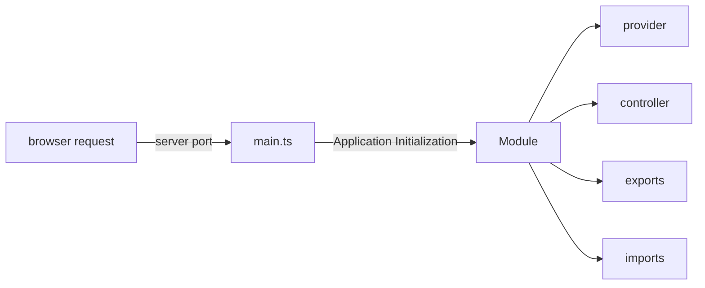

# learn-nestjs

- NestJS tutorial using Typescript, Yarn as package manager
- Node 20, Nest 10

### Installations

- Latest Node, NPM, Yarn
- **NestJS CLI**: `yarn global add @nestjs/cli`
- **Generate UUID**: `yarn add uuid`

### Getting Started

- Generate a project from CLI: `nest new <app_name>`
- The file named `app.module.ts` is the root file to begin, this is referred in `main.ts`. Leaving behind these two files in source folder, every other starter file can be removed.
- Run the application `yarn start:dev`. This runs the application in watch mode, so it restarts automatically with every change
- To create a new nest component such as module, service or controller, a best practice is to use nest cli to generate it using command `nest g <component_type> <component_name>`
- Generate Controller using CLI : `nest g controller <name> --no-spec` [do not create default test file, remember to send the same name for auto update]
- Generate Service using CLI : `nest g service <name> --no-spec` [remember to send the same name for auto update]
- For DB Postgres SQL is used that runs on Docker. To start using Postgres on Docker run: `docker run --name postgres-nest -p 5432:5432 -e POSTGRES_PASSWORD=postgres -d postgres`
  - Check container status : `docker container ls`
  - Stop container: `docker container stop postgres-nest`
  - Remove postgres: `docker container rm postgres-nest`
- Create server and database in PGAdmin tool. The database name in this project is : `nest-task-tutorial`

### Project Structure

1. **main.ts** : This is the entry point of every Nest.js based server. It has the code to listen to http traffic on a specified port and initializes **AppModule**
   Example:

```ts
async function bootstrap() {
  const app = await NestFactory.create(AppModule);
  await app.listen(3000);
}
bootstrap();
```

2. **Module** : Each Nest application must have at least one module. Module is the entry point to unit of functionality. This is the first object initialized from **main.ts**.

- Good Practice: Have one module per folder to keep functionalities better organized
- Important: Modules are singletons. So one instance can be imported by other modules
- Generate Module using CLI : `nest g module <name>`

Example:

```ts
@Module({
  providers: [RootService],
  controllers: [RootController],
  imports: [childModule, anotherChildModule, yetAnotherChildModule],
  exports: [RootService],
})
export class RootModule {}
```



3. **Controller** - Every module has a controller, that listens to http traffic and sends response.

- Every controller must be bound to a url path
- Contain handlers to handle endpoints such as GET, POST etc.
- Use service using dependency injection

4. **Service** - Class that has the business logic that is usually invoked from Controller.

- Service must be annotated with `@Injectable` annotation to be imported into handler methods inside controllers initiated as **Singleton** pattern.

5. **Data Transfer Object (DTO)** - Object to transfer data through network

- Responsible for storage, retrieval, serialization of data
- DTOs recommended to be created as Classes instead of interfaces
- It is different than creating models for entities
- DTOs are not mandatory, but useful for data consistency

6. **Pipes** - Used to modify, validate, handle error from request before passing in for further processing. More Info - [Class Validator](https://github.com/typestack/class-validator) implemented at application level

- Injected to controllers
- **Handler Pipe** : Handles the incoming request, throws exception if fails. Implemented by adding two packages: `yarn add class-validator class-transformer`. Example implementation in [create-task.dto.ts](./nest-basic-app/src/tasks/dto/create-task.dto.ts)
- **Parameter Pipe**: Handles at parameter level, slimmer implementation than Handler pipe, but tightly coupled implementation
- **Global Pipe**: Works at application level. As a result it applies to every handler and every parameter. Example implementation: [main.ts](./nest-basic-app/src/main.ts)

7. **Error Handling** - Nest JS makes error handling easy, by just throwing error in single statement. Example [getTaskStatus-Service](./nest-basic-app/src/tasks/tasks.service.ts)

- **Enum Validation** - Nest JS has decorator method to validate Enum values, example here is to validate task status.

8. **ObjectRelationalMapping** (ORM) - Technique that allows database interaction from application code using object oriented approach

- This helps in automatic data element mapping, reusability, no need to write SQL queries
- `TypeORM` is the typescript library widely used [TypeORM - Documentation](https://typeorm.io). [NestJS - Database Interaction](https://docs.nestjs.com/techniques/database)
- To use ORM with postgres sql following packages to be added by running: `yarn add typeorm @nestjs/typeorm pg`
- For temporary use typeORM can be imported into App module. However more optimal approach is to have ORM in its own module
- Entities must be defined with file extension as `*.entity.ts`. This name allows auto load of entity
- **Data Mapper** is the preferred approach for working with Database compared to Active Records approach, since Data Mapper allows seggregation of definition from functions. Example of implementation: [task.entity.ts](./nest-basic-app/src/tasks/tasks.entity.ts) and [tasks.repository.ts](./nest-basic-app/src/tasks/tasks.repository.ts)
- To make a Task repository available, it must be injected as depndency in the module it is referred from. Example: [task.module.ts](./nest-basic-app/src/tasks/tasks.module.ts)
- In entity class similar to Column() decorator relationship with other entities can also be defined. Example: Look at User Entity relationship with Tasks [user.entity.ts](./src/auth/user.entity.ts)
- The format of declaring One to many or many to one is done via a decoration as shown below: `@OneToMany(type => TaskEntity, task => task.user, {eager: true});` In this {eager: true} indicates that the relational data will be fetched automatically every time it is queried. In this example that would mean every time User data is fetched related tasks will also be fetched
- For this additional one to many relationship work, update the method to pass the value of the new entity added

9. **Authentication** - The implementation is similar to that of any other module. See example under [auth directory](./nest-basic-app/src/auth/auth.module.ts)

### Security

#### How to handle passwords

1. Passwords are not saved to DB in clear text ever. Passwords are hashed using algorithms such as SHA256. When user entered password is validated against this. The encrypted password is never decrypted, rather the user input is hashed and compared against the hash

2. However, a pattern can be drawn easily for what password means what hash, hence a random string is added before the password called as **salt**. Instead of a fixed salt a random salt for everypassword is recommended to make it unique. This can be generated using npm package [**bcrypt**](https://docs.nestjs.com/security/encryption-and-hashing#hashing)
3. Install bcrypt package using : `yarn add bcrypt`

#### JWT Token for Authorization

- JWT Token as **Three Parts** : Header, Payload, Signature
- **Header** : Metadata about the token such as: type, hashing algorithm
- **Payload** : User info, role, scope, issue time, expire time
- **Signature** : Signed by issuer using a private key that has information of Header and Payload in encrypted and encoded way

#### JWT AuthZ Process

- Once authenticated right after signin process, the JWT token value is sent as a request header to server
- The server then takes the payload information and based on the header info, it tries to created a hash data signature using the secret. If the secret matches with the signature then it is a valid token.
- If the payload is modified to increaed the access level or something then the signature created would not match with the signature sent from the issuer
- Best Practice: Should not contain real password. Should be short lived
- One of the popular node package is **passport.js** that can create and use JWT. To work with passport and JWT install following packages : `yarn add @nestjs/jwt @nestjs/passport passport passport-jwt @types/passport-jwt`

#### Use User object through all modules

- To use user object after authorization, consider creating a user decorator object accessible via all the modules
- This solves the problem of not fetching the entire user object from database when needed
- Example [get-user.decorator.ts](./src/auth/get-user.decorator.ts)

#### Obscure Sensitive information using Serialization and Interceptor

- Sensitive user informationn can be obscured using Interceptor concept to serialize data
- Add `@Exclude()` decorator on the attribute in the entity
- Apply `Interceptor` either at Application, Controller or Handler level. Application level would apply it globally. Example: add the following to task controller `@UseInterceptors(ClassSerializerInterceptor)`
- External Example here - [NodeJS GitHub](https://github.com/nestjs/nest/tree/master/sample/21-serializer/src)

### Control Environment Variables:

- Environment variables are used to control the application behavior based on the stage of deployment. For example DB connection, log levels

1. Add library `yarn add @nestjs/config`
2. Add Environment file reference to app.module.ts

```ts
imports: [
  ConfigModule.forRoot({
    envFilePath: [`.env.stage.${process.env.STAGE}`],
  }),
];
```

3. Create environment files to store variables. The file names should be named as : `.env.stage.dev` or `.env.stage.prod`
4. Store all the environment variable value in `key=value` format. e.g.: `SAMPLE_ENV_VALUE=dev_stage`
5. provide the stage name in script part in package.json `"start:dev": "STAGE=dev nest start --watch`
6. Must restart server, when environment variables are updated
7. To consume the environment variables, import config module in the module where this is required. Example add the following to task module:

```ts
@Module({
imports: [ConfigModule, ...],
...
```

8. Refer to config variable in the controller or service class. Example:

```ts
constructor(
  private configService: ConfigService,
) {
  console.log(`Environment Value is found as: ${configService.get('SAMPLE_ENV_VALUE')}`);
}
```

9. Under exceptional cases to override the value from the environment file, the value of the env variable can be passed as CLI to start script. Example: `SAMPLE_ENV_VALUE=overridden_value yarn start:dev`

### References:

- https://docs.nestjs.com - Official nest js documentation
- https://jwt.io - Validate JWT Token
- https://github.com/nestjs/nest/tree/master/sample/21-serializer - Apply Serializable Interceptor to hide data
- https://docs.nestjs.com/techniques/configuration - NestJS Configuration to control environment variables
